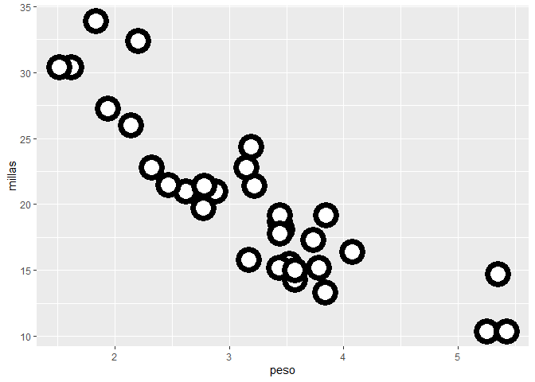
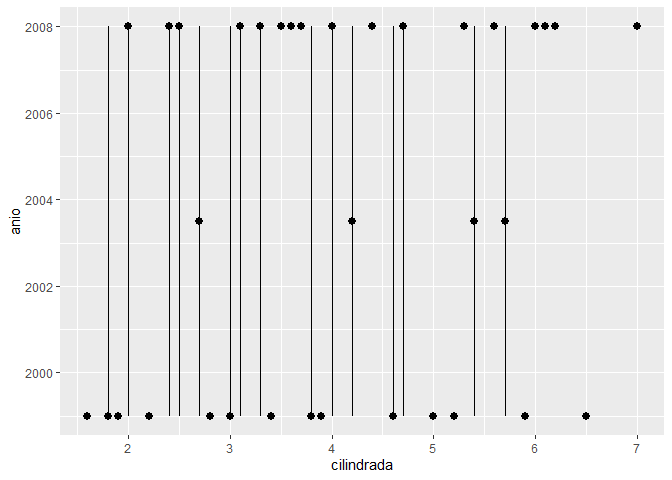
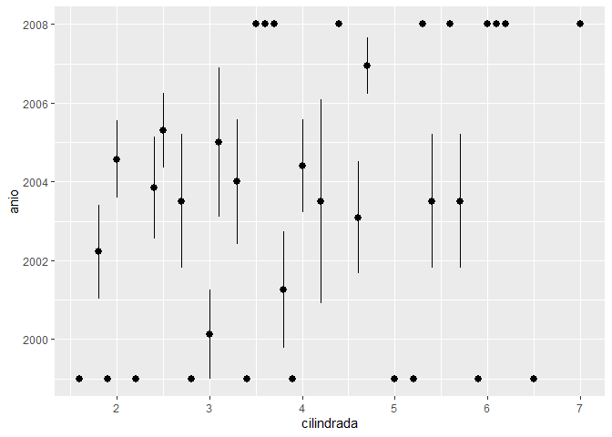
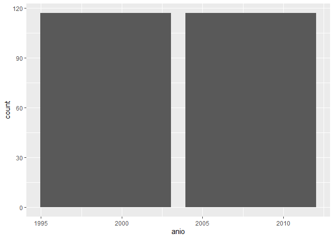
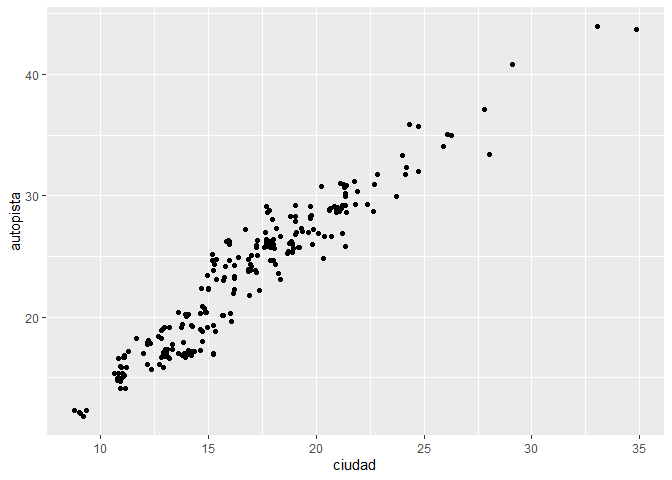
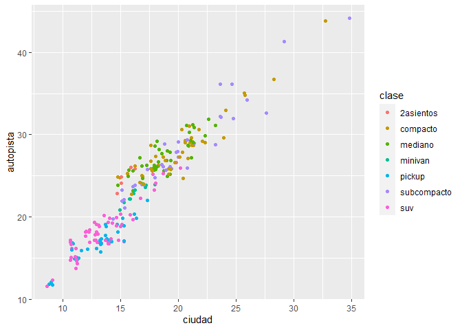
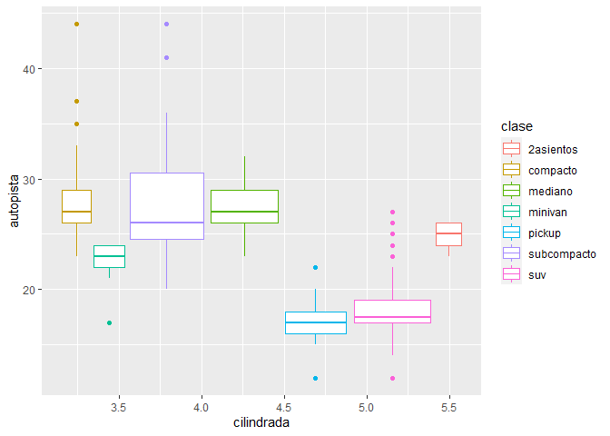
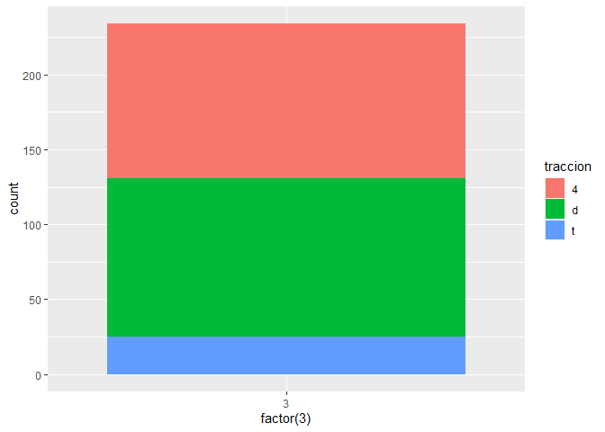
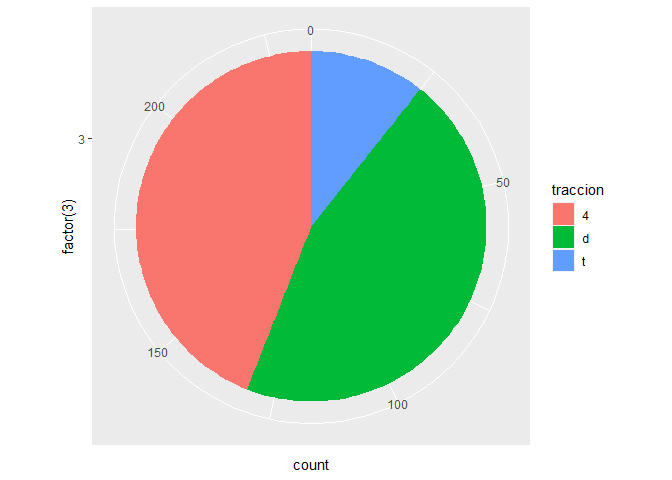

Tarea N°4
================
Rodríguez Conde Marko, Rodríguez Chapoñan Emanuel, Yucra Baquerizo
Braulio
25/1/2022

``` r
library(tidyverse)
```

    ## Warning: package 'tidyverse' was built under R version 4.1.2

    ## -- Attaching packages --------------------------------------- tidyverse 1.3.1 --

    ## v ggplot2 3.3.5     v purrr   0.3.4
    ## v tibble  3.1.6     v dplyr   1.0.7
    ## v tidyr   1.1.4     v stringr 1.4.0
    ## v readr   2.1.1     v forcats 0.5.1

    ## Warning: package 'ggplot2' was built under R version 4.1.2

    ## Warning: package 'tidyr' was built under R version 4.1.2

    ## Warning: package 'purrr' was built under R version 4.1.2

    ## Warning: package 'dplyr' was built under R version 4.1.2

    ## Warning: package 'forcats' was built under R version 4.1.2

    ## -- Conflicts ------------------------------------------ tidyverse_conflicts() --
    ## x dplyr::filter() masks stats::filter()
    ## x dplyr::lag()    masks stats::lag()

``` r
library(datos)
```

    ## Warning: package 'datos' was built under R version 4.1.2

``` r
library(ggplot2)
```

##Parte 1: Ggplot base #Ejecuta ggplot(data = millas). ¿Qué observas?

``` r
#1.Ejecuta ggplot(data = millas). ¿Qué observas?
ggplot(data = millas)
```

<!-- -->

``` r
##R-Este código crea un gráfico vacío, Solo se ve el fondo, pero no se dibuja nada sobre él.
#2.¿Cuántas filas hay en millas? ¿Cuántas columnas?
nrow(millas)
```

    ## [1] 234

``` r
ncol(millas)
```

    ## [1] 11

``` r
##R-Hay 234 filas y 11 columnas en el dataset millas.
#3.¿Qué describe la variable traccion? Lee la ayuda de ?millas para encontrar la respuesta.
unique(millas$traccion)
```

    ## [1] "d" "4" "t"

``` r
##R-traccion esa una variable categórica que clasifica los vehículos en tracción delantera, trasera o de cuatro ruedas.
#4.Realiza un gráfico de dispersión de autopista versus cilindros.
ggplot(millas, aes(x = autopista, y = cilindros)) +
  geom_point()
```

<!-- -->

``` r
#5¿Qué sucede cuando haces un gráfico de dispersión (scatterplot) de clase versus traccion? ¿Por qué no es útil este gráfico?
##R-No podemos realizar gráfica de dispersión en scatterplot, ya que ambas variables son categóricas.
```

#Parte 2: Mapeos estéticos

``` r
#1.¿Qué no va bien en este código? ¿Por qué hay puntos que no son azules?
 ggplot(data = millas) +
   geom_point(mapping = aes(x = cilindrada, y = autopista, color = "blue"))
```

<!-- -->

``` r
##R-Se incluyó el color dentro de aes(), por lo cual se trata como una variable, lo cual sería útil si tuvieramos una columna con información de los colores. Si queremeos los puntos azules, debemos cambiar los parámetros.
ggplot(data = millas) +
     geom_point(mapping = aes(x = cilindrada, y = autopista), color = "blue")
```

<!-- -->

``` r
#2.¿Qué variables en millas son categóricas? ¿Qué variables son continuas? (Pista: escribe ?millas para leer la documentación de ayuda para este conjunto de datos). ¿Cómo puedes ver esta información cuando ejecutas millas?
##R- Variables categóricas: modelo, transmisión, tracción, combustible y clase.
##R-2-Variables continuas: cilindrada, año, cilindros, ciudad, autopista.
#3.Asigna una variable continua a color, size, y shape. ¿Cómo se comportan estas estéticas de manera diferente para variables categóricas y variables continuas?
##R-Una posibilidad es graficar rendimiento de combustible en autopista dado el tipo de motor.Como información adicional usamos el rendimiento en ciudad como color, de modo de contar con una paleta de colores informativa. 
ggplot(millas, aes(x = cilindrada, y = autopista, colour = ciudad)) +
  geom_point()
```

<!-- -->

``` r
#4.¿Qué ocurre si asignas o mapeas la misma variable a múltiples estéticas?
ggplot(millas, aes(x = cilindrada, y = autopista, colour = autopista, size = autopista)) +
  geom_point()
```

<!-- -->

``` r
##R-Se va generar un gráfico redundante.
#5.¿Qué hace la estética stroke? ¿Con qué formas trabaja? (Pista: consulta ?geom_point)
##R-Cambia el tamaño de los bordes de las formas 21 a 25. Para estas formas es posible cambiar el color de relleno y borde y también el tamaño de los bordes.
ggplot(mtautos, aes(peso, millas)) +
  geom_point(shape = 21, colour = "black", fill = "white", size = 7, stroke = 4)
```

<!-- -->

``` r
#6.¿Qué ocurre si se asigna o mapea una estética a algo diferente del nombre de una variable, como aes(color = cilindrada < 5)?
##R-En el caso de cilindrada < 5 el resultado es verdadero o falso y según esto se incluyen los colores en el gráfico.
ggplot(millas, aes(x = cilindrada, y = autopista, colour = cilindrada < 5)) +
  geom_point()
```

<!-- -->
#PARTE 3:FACETAS

``` r
#1.¿Qué ocurre si intentas separar en facetas una variable continua?
#R-La variable continua es convertida a una variable categórica y el gráfico contiene una faceta para cada valor.
#2. ¿Qué significan las celdas vacías que aparecen en el gráfico generado usando facet_grid(traccion ~ cilindros)? 
ggplot(data = millas) +
  geom_point(mapping = aes(x = autopista, y = ciudad)) +
  facet_grid(traccion ~ cilindros)
```

<!-- -->

``` r
#R-Las vacías corresponden a combinaciones de tracción y cilindros que no tienen observaciones.
#2.1.¿Cómo se relacionan con este gráfico?
ggplot(data = millas) +
  geom_point(mapping = aes(x = traccion, y = cilindros))
```

<!-- -->

``` r
#R- Podemos decir que son las mismas ubicaciones en el gráfico de dispersión de autopista y ciudad que no tienen gráfico.
ggplot(data = millas) +
  geom_point(mapping = aes(x = autopista, y = ciudad))
```

<!-- -->

``` r
#3. ¿Qué grafica el siguiente código? ¿Qué hace?
ggplot(data = millas) +
  geom_point(mapping = aes(x = cilindrada, y = autopista)) +
  facet_grid(traccion ~ .)
```

<!-- -->

``` r
ggplot(data = millas) +
  geom_point(mapping = aes(x = cilindrada, y = autopista)) +
  facet_grid(. ~ cilindros)
```

<!-- -->

``` r
##R-Podemos observar como se dividen cada una de las gráficas, mediante facet_grid() se podría realizar, parece que se pueden ver gráficas dentro de una sola.
#4.Mira de nuevo el primer gráfico en facetas presentado en esta sección:
ggplot(data = millas) +
  geom_point(mapping = aes(x = cilindrada, y = autopista)) +
  facet_wrap(~ clase, nrow = 2)
```

<!-- -->

``` r
#4.1.¿Cuáles son las ventajas de separar en facetas en lugar de aplicar una estética de color?
#R-Porque podemos ver el modelo, la cilindrada y la autopsita en cantidad.
#4.2.¿Cuáles son las desventajas?
#R-Podría ser una desventaja la estética y no percibir las demás variables
#4.3.¿Cómo cambiaría este balance si tuvieras un conjunto de datos más grande? - Lee ?facet_wrap
#4.3.1¿Qué hace nrow? ¿Qué hace ncol?
#R- nrow menciona el número de filas y ncol determina las columnas al momento de generar las facetas.
#4.3.2.¿Por qué facet_grid() no tiene argumentos nrow y ncol?
#R- No son necesarios con facet_grid() ya que el número de valores únicos en la función determina el número de filas y columnas.
#4.3.3.Cuando usas facet_grid(), generalmente deberías poner la variable con un mayor número de niveles únicos en las columnas. ¿Por qué?
#R- Porque así me genera más espacio entre las columnas.
```

#Parte 4: Objetos geométricos

``` r
#1. ¿Qué geom usarías para generar un gráfico de líneas? 
geom_line()
```

    ## geom_line: na.rm = FALSE, orientation = NA
    ## stat_identity: na.rm = FALSE
    ## position_identity

``` r
#1.2. ¿Y para un diagrama de caja?
geom_boxplot()
```

    ## geom_boxplot: outlier.colour = NULL, outlier.fill = NULL, outlier.shape = 19, outlier.size = 1.5, outlier.stroke = 0.5, outlier.alpha = NULL, notch = FALSE, notchwidth = 0.5, varwidth = FALSE, na.rm = FALSE, orientation = NA
    ## stat_boxplot: na.rm = FALSE, orientation = NA
    ## position_dodge2

``` r
#1.3. ¿Y para un histograma? 
geom_histogram()
```

    ## geom_bar: na.rm = FALSE, orientation = NA
    ## stat_bin: binwidth = NULL, bins = NULL, na.rm = FALSE, orientation = NA, pad = FALSE
    ## position_stack

``` r
#1.4. ¿Y para un gráfico de área?
geom_area()
```

    ## geom_area: na.rm = FALSE, orientation = NA, outline.type = upper
    ## stat_identity: na.rm = FALSE
    ## position_stack

``` r
#2.Ejecuta este código en tu mente y predice cómo se verá el output. Luego, ejecuta el código en R y verifica tus predicciones.
ggplot(data = millas, mapping = aes(x = cilindrada, y = autopista, color = traccion)) +
  geom_point() +
  geom_smooth(se = FALSE)
```

    ## `geom_smooth()` using method = 'loess' and formula 'y ~ x'

<!-- -->

``` r
#R-diagrama de dispersión cilindrada en el eje x, autopista en el eje y, y los puntos de colores sería la tracción.
#3. ¿Qué muestra show.legend = FALSE? 
#R- Oculta la leyenda.
#3.1.¿Qué pasa si lo quitas? ¿Por qué crees que lo utilizamos antes en el capítulo?
#R- Si quitamos el argumento mostrará la relación entre tracición y la paleta de colores
#Probemos
ggplot(data = millas) +
  geom_smooth(
    mapping = aes(x = cilindrada, y = autopista, colour = traccion),
    show.legend = FALSE
  )
```

    ## `geom_smooth()` using method = 'loess' and formula 'y ~ x'

<!-- -->

``` r
ggplot(data = millas) +
  geom_smooth(mapping = aes(x = cilindrada, y = autopista, colour = traccion))
```

    ## `geom_smooth()` using method = 'loess' and formula 'y ~ x'

<!-- -->

``` r
#4.¿Qué hace el argumento se en geom_smooth()?
#R-Agrega bandas de error estándar a las líneas.
#5. ¿Se verán distintos estos gráficos? ¿Por qué sí o por qué no?
ggplot(data = millas, mapping = aes(x = cilindrada, y = autopista)) +
  geom_point() +
  geom_smooth()
```

    ## `geom_smooth()` using method = 'loess' and formula 'y ~ x'

<!-- -->

``` r
ggplot() +
  geom_point(data = millas, mapping = aes(x = cilindrada, y = autopista)) +
  geom_smooth(data = millas, mapping = aes(x = cilindrada, y = autopista))
```

    ## `geom_smooth()` using method = 'loess' and formula 'y ~ x'

<!-- -->

``` r
#R-No, se ven muy similares, se podría decir iguales, ya que geom_point y geom_smooth toman los datos y estéticas de ggplot.
#6. Recrea el código R necesario para generar los siguientes gráficos:
ggplot(data = millas, mapping = aes(x = cilindrada, y = autopista)) +
   geom_point() +
   geom_smooth(se = FALSE)
```

    ## `geom_smooth()` using method = 'loess' and formula 'y ~ x'

<!-- -->

``` r
ggplot(data = millas, mapping = aes(x = cilindrada, y = autopista)) +
   geom_smooth(aes(group = traccion), se = FALSE) +
   geom_point()
```

    ## `geom_smooth()` using method = 'loess' and formula 'y ~ x'

<!-- -->

``` r
ggplot(data = millas, mapping = aes(x = cilindrada, y = autopista, color = traccion)) +
   geom_point() +
   geom_smooth(se = FALSE)
```

    ## `geom_smooth()` using method = 'loess' and formula 'y ~ x'

<!-- -->

``` r
ggplot(data = millas, mapping = aes(x = cilindrada, y = autopista)) +
   geom_point(aes(color = traccion)) +
   geom_smooth(se = FALSE)
```

    ## `geom_smooth()` using method = 'loess' and formula 'y ~ x'

<!-- -->

``` r
ggplot(data = millas, mapping = aes(x = cilindrada, y = autopista)) +
   geom_point(aes(color = traccion)) +
   geom_smooth(aes(linetype = traccion), se = FALSE)
```

    ## `geom_smooth()` using method = 'loess' and formula 'y ~ x'

<!-- -->

``` r
ggplot(data = millas, mapping = aes(x = cilindrada, y = autopista)) +
   geom_point(size = 4, colour = "white") +
   geom_point(aes(colour = traccion))
```

<!-- -->
##Parte 5: Gráficos estadísticos

``` r
#1. ¿Cuál es el geom predeterminado asociado con stat_summary()? ¿Cómo podrías reescribir el gráfico anterior para usar esa función geom en lugar de la función stat?
ggplot(data = millas)+
  stat_summary(
    mapping = aes(x = cilindrada, y = anio),
    fun.ymin = min,
    fun.ymax = max,
    fun.y = median
  )
```

    ## Warning: `fun.y` is deprecated. Use `fun` instead.

    ## Warning: `fun.ymin` is deprecated. Use `fun.min` instead.

    ## Warning: `fun.ymax` is deprecated. Use `fun.max` instead.

<!-- -->

``` r
#En lugar de usar stat probaremos con geom_pointrange()
ggplot(data = millas) +
  geom_pointrange(
    mapping = aes(x = cilindrada, y = anio),
    stat = "summary",
    fun.ymin = min,
    fun.ymax = max,
    fun.y = median
  )
```

    ## Warning: Ignoring unknown parameters: fun.ymin, fun.ymax, fun.y

    ## No summary function supplied, defaulting to `mean_se()`

    ## Warning: Removed 6 rows containing missing values (geom_segment).

<!-- -->

``` r
#2.¿Qué hace geom_col()? ¿En qué se diferencia de geom_bar()?
#R-crea columnas desde el 0 del eje hasta la intersección de los ejes.
# geom_col() usa stat_identity(), que deja los datos sin transformar y stat_bin(), que espera únicamente los valores de x.
#geom_bar() hace una transformación estadística predeterminada en el marco de datos.
#3.La mayoría de los geoms y las transformaciones estadísticas vienen en pares que casi siempre se usan en conjunto. Lee la documentación y haz una lista de todos los pares. ¿Qué tienen en común?
#geom_bar() ---- stat_count()
#geom_bin2d() ----  stat_bin_2d()
#geom_boxplot() ----    stat_boxplot()
#geom_contour() ----    stat_contour()
#geom_count() ----  stat_sum()
#geom_density() ----    stat_density()
#geom_density_2d() ---- stat_density_2d()
#geom_hex() ----    stat_hex()
#geom_freqpoly() ----   stat_bin()
#geom_histogram() ----  stat_bin()
#geom_qq_line() ----    stat_qq_line()
#geom_qq() ---- stat_qq()
#geom_quantile() ----   stat_quantile()
#geom_smooth() ---- stat_smooth()
#geom_violin() ---- stat_violin()
#geom_sf() ---- stat_sf()
#R-Tienen en común los nombres, son similares como geom_smooth y stat_smooth.La mayoría de los estadísticos usan por defecto la geometría que le corresponde en la tabla anterior.
#4. ¿Qué variables calcula stat_smooth()? ¿Qué parámetros controlan su comportamiento?
#R.1.- ymin:menor valor del intervalo, ymax:mayor valor del intervalo, "se":error estándar.
#R.2.- Los parámetros son method, formula y na.rm
#5.En nuestro gráfico de barras de proporción necesitamos establecer group=1. ¿Por qué? En otras palabras, ¿cuál es el problema con estos dos gráficos?
ggplot(millas, aes(x = anio,group = 1, fill = traccion)) +
  geom_bar()
```

<!-- -->

``` r
#R-Las proporciones se calculan dentro de los grupos.
```

#PARTE 6: AJUSTE DE POSICIÓN

``` r
#1¿Cuál es el problema con este gráfico? ¿Cómo podrías mejorarlo?
ggplot(data = millas, mapping = aes(x = ciudad, y = autopista)) +
  geom_point()
```

<!-- -->

``` r
#R- Se presentan múltiples observaciones para cada combinación de ciudad y autopista.
ggplot(data = millas, mapping = aes(x = ciudad, y = autopista)) +
  geom_point(position = "jitter")
```

<!-- -->

``` r
#2. ¿Qué parámetros de geom_jitter() controlan la cantidad de ruido?
#R- width controla el desplazamiento vertical y height controla el horizontal; ambas introducen ruido.
#3. Compara y contrasta geom_jitter() con geom_count()
ggplot(data = millas, mapping = aes(x = ciudad, y = autopista, color = clase)) +
  geom_jitter()
```

<!-- -->

``` r
ggplot(data = millas, mapping = aes(x = ciudad, y = autopista, color = clase)) +
  geom_count()
```

<!-- -->

``` r
#R- geom_jitter agrega variaciones al azar a los puntos del gráfico, distorsiona la ubicación de los puntos en el gráfico; por otro lado, geom_count cammbia el tamaño de los puntos relativos a la cantidad de observaciones.
#4. ¿Cuál es el ajuste de posición predeterminado de geom_boxplot()? Crea una visualización del conjunto de datos de millas que lo demuestre.
#R.4.1- "dodge2", mueve las geometrías horizontalmente para evitar la superposición.
ggplot(data = millas, aes(x = cilindrada, y = autopista, colour = clase)) +
  geom_boxplot()
```

<!-- -->
#Parte 7: Sistema de coordenadas

``` r
#1.Convierte un gráfico de barras apiladas en un gráfico circular usando coord_polar().
ggplot(millas, aes(x = factor(3), fill = traccion)) +
  geom_bar()
```

<!-- -->

``` r
ggplot(millas, aes(x = factor(3), fill = traccion)) +
  geom_bar(width = 1) +
  coord_polar(theta = "y")
```

<!-- -->

``` r
#2.¿Qué hace labs()? Lee la documentación.
#R-"Labs", agrega los títulos de los ejes, título del gráfico y la leyenda. Para agregar títulos también tenemos xlab(), ylab() y ggtitle()
#3. ¿Cuál es la diferencia entre coord_quickmap() y coord_map()?
#R- coord_map() usa una proyección cartográfica para proyectar la Tierra sobre una superficie bidimensional; en cambio, coord_quickmap usa una aproximación más rápida que ignora la curvatura de la tierra y ajusta de acuerdo a la razón de latitud y longitud.
#4. ¿Qué te dice la gráfica siguiente sobre la relación entre ciudad y autopista? ¿Por qué es coord_fixed() importante? ¿Qué hace geom_abline()?
ggplot(data = millas, mapping = aes(x = ciudad, y = autopista)) +
  geom_point()+
  geom_abline()+
  coord_fixed()
```

<!-- -->

``` r
#La función geom_abline por sí sola cre una línea de menor a mayor con referencia a los puntos, pero si añadimos la función coord_fixed() asegura que la línea que genera geom_abline() tenga un ángulo de 45 grados. De este modo es más fácil comparar a partir de los casos en que los rendimientos en autopista y ciudad son iguales.
```

This is an R Markdown document. Markdown is a simple formatting syntax
for authoring HTML, PDF, and MS Word documents. For more details on
using R Markdown see <http://rmarkdown.rstudio.com>.

When you click the **Knit** button a document will be generated that
includes both content as well as the output of any embedded R code
chunks within the document. You can embed an R code chunk like this:

``` r
summary(cars)
```

    ##      speed           dist       
    ##  Min.   : 4.0   Min.   :  2.00  
    ##  1st Qu.:12.0   1st Qu.: 26.00  
    ##  Median :15.0   Median : 36.00  
    ##  Mean   :15.4   Mean   : 42.98  
    ##  3rd Qu.:19.0   3rd Qu.: 56.00  
    ##  Max.   :25.0   Max.   :120.00

## Including Plots

You can also embed plots, for example:

<!-- -->

Note that the `echo = FALSE` parameter was added to the code chunk to
prevent printing of the R code that generated the plot.
